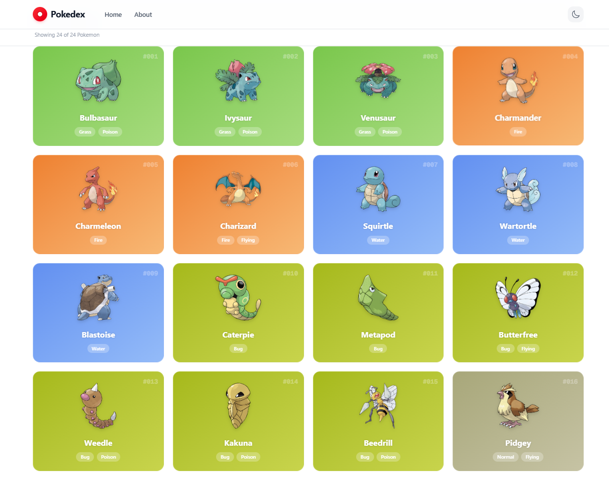

<p align="center">
  
</p>

<h1 align="center">Pokedex</h1>

<p align="center">
  A modern Pokedex app built with Next.js, Tailwind CSS, and Chart.js.
  Browse every Pokemon with infinite scroll, type-colored cards, and interactive stat charts.
</p>

<p align="center">
  <a href="https://pokeapi.co/">PokeAPI</a> •
  <a href="#">Live Demo</a>
</p>

## Features

- Infinite scroll through all 1300+ Pokemon
- Type-based gradient card colors
- Official artwork sprites
- Detailed stats modal with radar chart
- Dark mode support
- Responsive design

## Getting Started

```bash
npm install
npm run dev
```

Open [http://localhost:3000](http://localhost:3000).

## Tech Stack

Next.js • React • TypeScript • Tailwind CSS • Chart.js • PokeAPI
